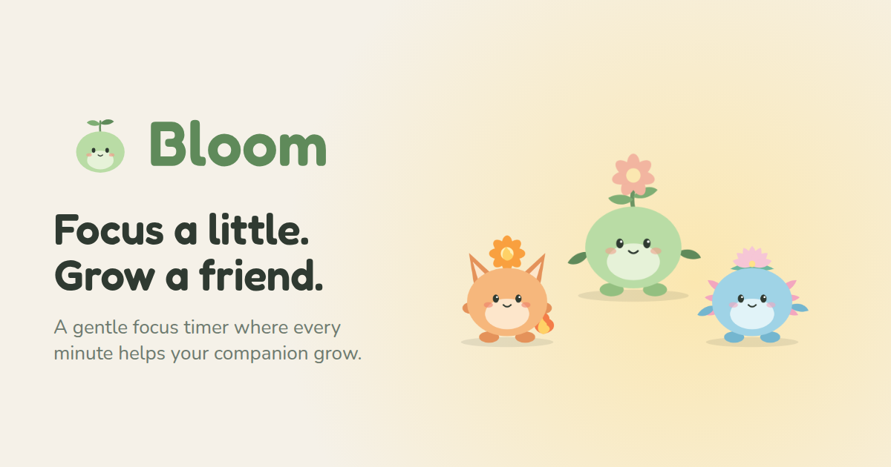

<p align="center"></p>

# Bloom

A gentle, mobile-first focus timer. Staying present grows a small companion through six stages.
Pick one of three starters: Bloomling (Leaf), Cinder (Ember), Ripple (Tide).
It encourages focus rather than enforcing it: no app blocking, no guilt.



See [CHANGELOG.md](CHANGELOG.md) for release notes (also in-app under Settings → What’s new).

## Run
```sh
npm install
npm run dev      # local dev server
npm test         # unit tests
npm run build    # static site in dist/ (strict CSP added)
```

## How it works
- **Growth:** cumulative focus minutes → stages at 0 · 25 · 150 · 500 · 1200 · 2500. The first full
  25-minute session evolves your companion (fast first reward); later gaps widen (≈ day 3, week 2,
  month 1, month 2–3 at 1–2 sessions/day). Sessions under 5 minutes don't add growth.
  Ending early still credits minutes focused. These are starting points — tune with real usage data.
- **Streak:** consecutive days with a counted session; one missed day per 7 is forgiven.
- **Honest timer:** pauses when the tab is hidden and resumes on return. A reload restores the session paused.
  Leaving for up to 60 seconds doesn't pause (grace period). Progress is checkpointed every 15s.
  Screen Wake Lock keeps the phone screen on during a session so it doesn't pause itself.
- **Ambient sound:** per-species soundscape synthesized with Web Audio (no downloads).
- **Breaks:** optional 5-min break after completed sessions, 15 min every 4th.
- **Focus list:** up to 3 items per session, checked off while focusing.
- **Themes:** Auto / Light / Night. **PWA:** installable, works offline. **Backup:** export/import a JSON file.

## Architecture (built to grow a backend)
```
src/
  logic/        pure rules: growth, streak, timer, dates (no DOM, no storage)
  domain/       types (API-shaped, UUID, append-only records), stats, SessionService
  state/        BloomRepository interface + LocalRepository (localStorage, validated, versioned)
  companion/    species registry + SVG art (add a species in species.ts + render.ts)
  screens/      onboarding, home, start, running, end, settings
  copy.ts       all user-facing text
```
- UI → `SessionService` → `BloomRepository`. To add a backend, implement `BloomRepository`
  (e.g. `ApiRepository`, or a sync wrapper around `LocalRepository`) and swap it in `main.ts`.
- Growth totals and streaks are **derived** from session history, so server and client agree.
- Stored data has a `schemaVersion`; add migration steps in `localRepository.ts#migrate` (v1→v2 is there).
- Sessions carry a `companionId`, so a future collection ("garden") needs no migration.
- Device preferences (theme, sound) live separately in `state/prefs.ts` and are never meant to sync.

## Privacy & security
- No network requests, analytics, third-party scripts, or fonts. Production CSP sets `connect-src 'none'`.
  When a backend is added, allow only its origin there.
- User text is rendered via text nodes only (never `innerHTML`); stored data is validated and size-limited on load.
- "Clear my data" wipes everything from the device. Backups are created and read locally; imported
  files are size-limited and fully validated before anything is replaced.
- The service worker caches only Bloom's own files, never user data.
